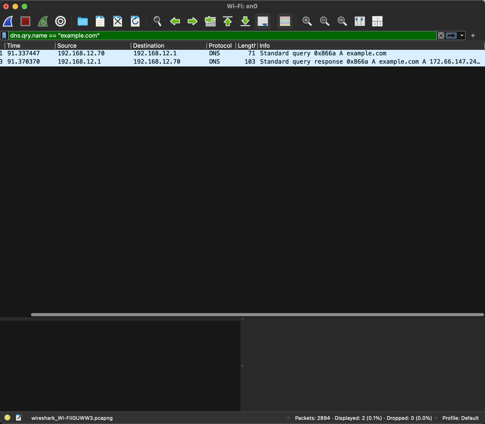
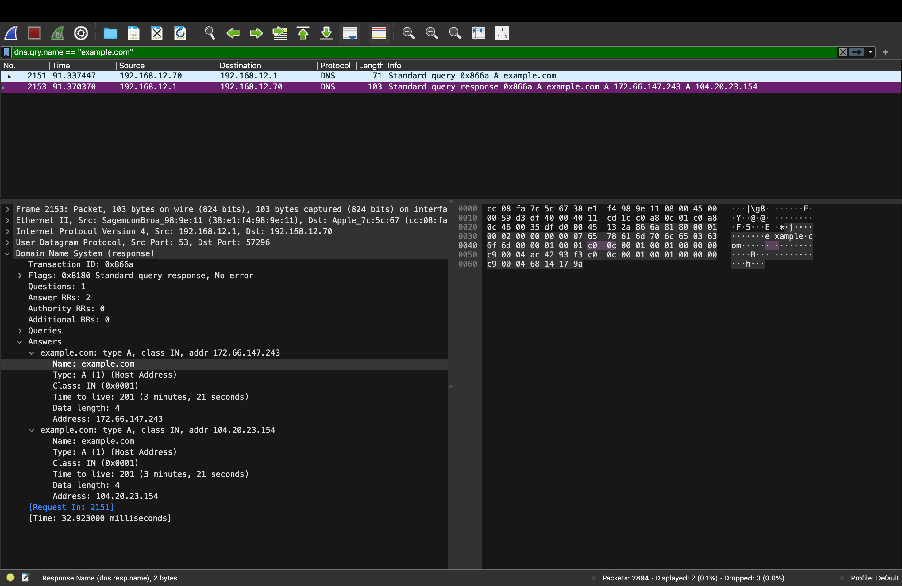
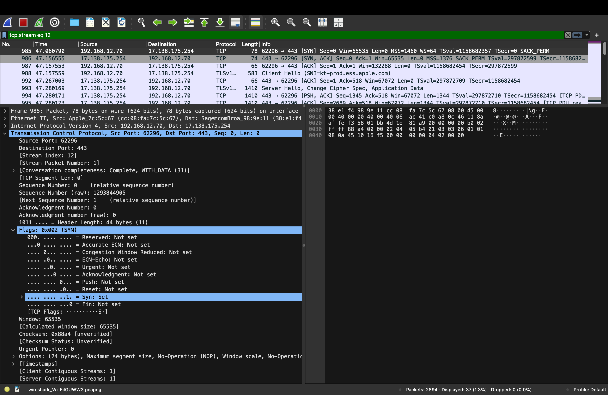
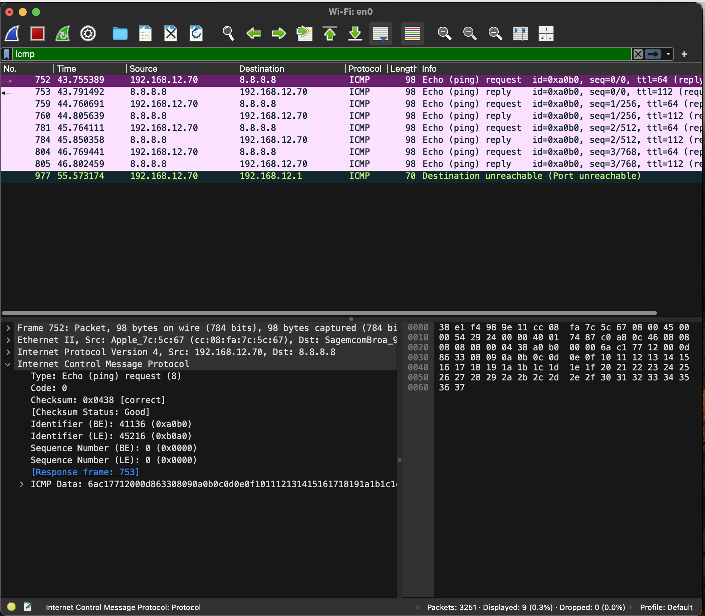
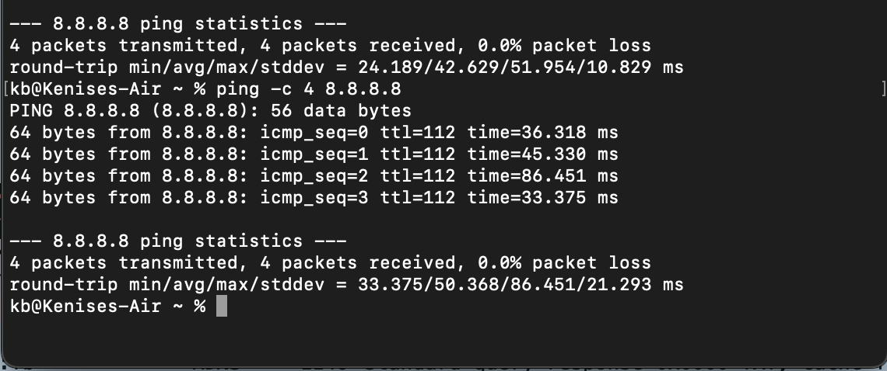

# Wireshark Network Traffic Analysis

## Project Overview

This project demonstrates hands-on network traffic analysis using Wireshark. The purpose of the lab was to capture and analyze common network protocols and better understand how network communication appears at the packet level.

Using Wireshark and macOS Terminal, I analyzed DNS resolution, TCP connection establishment, TLS/HTTPS communication, and ICMP connectivity. The lab also provided practical experience using Wireshark display filters and interpreting packet details for network troubleshooting.

---

## Objectives

- Capture live network traffic using Wireshark
- Analyze DNS queries and responses
- Examine the TCP three-way handshake
- Identify TLS/HTTPS communication
- Analyze ICMP Echo Request and Echo Reply packets
- Use Wireshark display filters to isolate network protocols
- Interpret source and destination IP addresses
- Identify TCP ports and protocol behavior
- Practice basic network troubleshooting

---

## Lab Environment

| Component | Configuration |
|---|---|
| Operating System | macOS |
| Packet Analyzer | Wireshark |
| Command-Line Tool | Terminal |
| Network Interface | Wi-Fi (`en0`) |
| Connectivity Target | `8.8.8.8` |
| DNS Test Domain | `example.com` |

---

# 1. DNS Analysis

DNS traffic was captured and filtered in Wireshark to examine how domain-name resolution occurs.

A DNS query for `example.com` was transmitted from the local system to the DNS server. The DNS server successfully responded with IPv4 addresses associated with the domain.

This demonstrated how DNS translates a human-readable domain name into an IP address that systems can use for network communication.

### DNS Query and Response

The capture below isolates the DNS request and corresponding response for `example.com`.

### DNS Response Analysis

The DNS response was then inspected in greater detail. Wireshark showed the returned **A records**, confirming successful name resolution.

The response contained IPv4 addresses including:

- `172.66.147.243`
- `104.20.23.154`

This analysis demonstrated how Wireshark can be used to verify DNS resolution and troubleshoot potential name-resolution problems.

---

# 2. TCP Three-Way Handshake Analysis

After examining DNS, TCP traffic was analyzed to observe how a reliable connection is established between a client and server.

The TCP connection followed the standard three-way handshake:

1. **SYN** – The client requested a connection with the remote server.
2. **SYN-ACK** – The server acknowledged the request and responded.
3. **ACK** – The client acknowledged the server's response, completing the connection.

The captured traffic showed the local system communicating with a remote server over destination port **443**, which is commonly associated with HTTPS.

### TCP Handshake Evidence

Wireshark was used to isolate the TCP stream and identify the SYN, SYN-ACK, and ACK packets involved in establishing the connection.

The packet details also allowed individual TCP flags to be examined, demonstrating how Wireshark can be used to troubleshoot connection-establishment problems.

---

# 3. TLS/HTTPS Analysis

After the TCP connection was established, the communication transitioned into TLS.

The capture contained a **TLS Client Hello**, which represents an early stage of establishing an encrypted session between the client and server.

The Client Hello included information used during TLS negotiation, such as supported protocol versions, cipher-related information, extensions, and the requested server name.

The capture identified the server name:

`kt-prod.ess.apple.com`

The client advertised support for modern TLS versions, including **TLS 1.3**.

### TLS Client Hello Evidence

This analysis demonstrated the relationship between TCP and TLS:

**TCP Connection → TLS Negotiation → Encrypted Application Traffic**

Once the secure session is established, application data is encrypted rather than transmitted as easily readable plaintext.

---

# 4. ICMP Connectivity Analysis

ICMP traffic was analyzed to demonstrate basic network connectivity testing and troubleshooting.

The following command was executed from macOS Terminal:

`ping -c 4 8.8.8.8`

This generated four ICMP Echo Requests to `8.8.8.8`.

Wireshark captured the outgoing Echo Requests and their corresponding Echo Replies.

### ICMP Echo Request and Reply

The capture demonstrated successful two-way IP communication:

**Local System → ICMP Echo Request → 8.8.8.8**

**Local System ← ICMP Echo Reply ← 8.8.8.8**

Wireshark also allowed individual ICMP fields to be inspected, including packet type, identifier, sequence number, source IP address, and destination IP address.

---

## Ping Connectivity Verification

Terminal output was used to verify the results observed in Wireshark.

The connectivity test produced:

- **Packets transmitted:** 4
- **Packets received:** 4
- **Packet loss:** 0%
- **Destination:** `8.8.8.8`

The successful Echo Replies and 0% packet loss confirmed that IP connectivity between the local system and the remote destination was functioning properly.

---

# Key Findings

This lab demonstrated several important stages of network communication and how each can be examined during troubleshooting.

### DNS Resolution

DNS translated `example.com` into IPv4 addresses, demonstrating how systems locate remote hosts using domain names.

### TCP Connection Establishment

The SYN, SYN-ACK, and ACK packets demonstrated how TCP establishes a reliable connection before application communication begins.

### TLS/HTTPS Communication

TLS traffic demonstrated how secure communication is negotiated after the underlying TCP connection has been established.

### ICMP Connectivity

ICMP Echo Requests and Echo Replies demonstrated how `ping` can be used to verify IP connectivity between systems.

Together, the packet analysis demonstrated the general communication flow:

**DNS Resolution → TCP Connection → TLS Negotiation → Encrypted Communication**

ICMP was separately used to test and verify basic network reachability.

---

# Skills Demonstrated

- Wireshark packet capture and analysis
- Network troubleshooting
- DNS query and response analysis
- DNS A record identification
- TCP/IP fundamentals
- TCP three-way handshake analysis
- SYN, SYN-ACK, and ACK flag identification
- TCP port analysis
- TLS/HTTPS traffic analysis
- TLS Client Hello identification
- ICMP Echo Request and Echo Reply analysis
- Wireshark display filters
- Packet header interpretation
- Source and destination IP analysis
- macOS Terminal networking commands
- Basic network connectivity testing

---

# Security Considerations

The original `.pcapng` packet capture is stored locally and is intentionally excluded from this public repository.

Packet captures may contain network metadata, device information, IP addresses, domain requests, and unrelated network traffic. Screenshots containing only the traffic relevant to this lab were used instead to demonstrate the analysis while limiting unnecessary exposure of captured network data.

---

# Conclusion

This project provided practical experience capturing and analyzing network traffic rather than relying only on theoretical knowledge of networking protocols.

Using Wireshark made it possible to observe DNS resolution, TCP connection establishment, TLS negotiation, and ICMP communication at the packet level. The lab also demonstrated how packet analysis can assist IT and security professionals with identifying connectivity problems, validating network behavior, and troubleshooting communication between systems.
